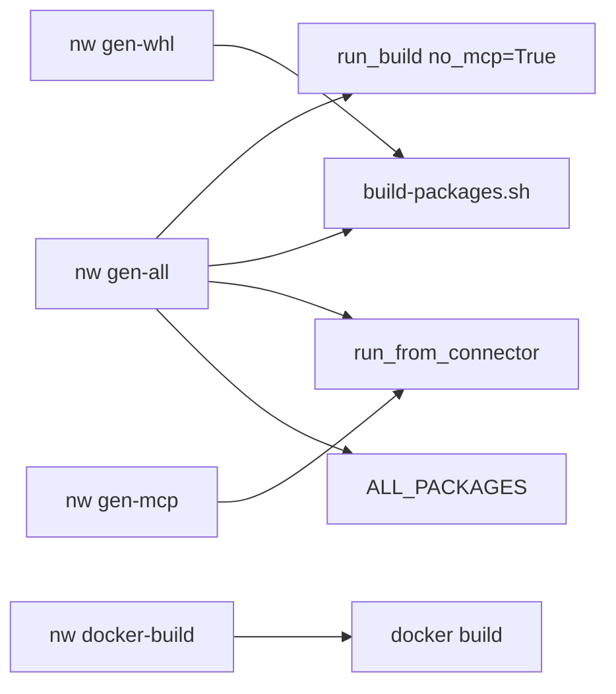
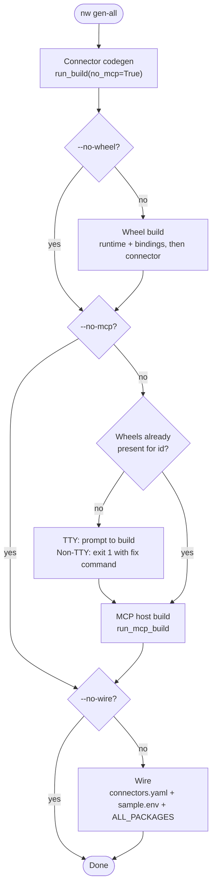

<!--
SPDX-FileCopyrightText: 2026 AOT Technologies

SPDX-License-Identifier: Apache-2.0
-->

# nw CLI

`nw` is the unified CLI for the OpenAPI → connector → wheel → MCP host → Docker image pipeline. It orchestrates [`nw-connector-builder`](nw-connector-builder.md), [`scripts/build-packages.sh`](packaging.md), and [`nw-mcp-builder`](mcp-servers.md) without replacing those tools.

ToolHive deploy/verify (`thv`) is **out of scope** — `nw` stops at `docker-build`. See `scripts/deploy-openapi-mcp-toolhive.md` for manual deploy steps.

---

## Install

`nw-cli` is part of the monorepo **dev** dependency group. From the **node-wire** repo root (hard assumption — there is no `--node-wire-root` flag):

```bash
uv sync
uv run nw --help
uv run nw --version   # or -V
```

---

## Commands

| Command | What it does |
|---------|----------------|
| `nw gen-all` | One-shot: connector codegen → Linux wheels → MCP host → wire |
| `nw gen-whl` | Standalone wheel build via `scripts/build-packages.sh` |
| `nw gen-mcp` | Standalone MCP host (requires existing wheels) |
| `nw docker-build` | `docker build` inside `nw-mcp-builder/out/<server>-mcp/` |



### `nw gen-all`

```bash
uv run nw gen-all \
  --connector-id pet_store \
  --path path/to/openapi.yaml
```

| Flag | Effect |
|------|--------|
| `--connector-id` | Connector id (required) |
| `--path` | OpenAPI/Swagger file or URL (required) |
| `--no-wheel` | Skip wheel build |
| `--no-mcp` | Skip MCP host build |
| `--no-wire` | Skip `connectors.yaml` / `sample.env` / `ALL_PACKAGES` registration |
| `--force` | Overwrite existing connector / MCP output |

Stages run in-process and in order, each skippable independently; the `mcp` stage additionally checks for wheels before building and can trigger a build-or-prompt sub-step of its own:



Stages are **in-process** function calls (never re-invokes `nw`). Connector codegen always passes `no_mcp=True` to `run_build` so the builder’s host-only MCP hand-off is skipped; MCP uses `skip_build_wheels=True` against wheels from `build-packages.sh`.

When wire is enabled:

- `run_build(..., wire=True)` updates `config/connectors.yaml` and `sample.env`
- `nw` inserts `packages/connectors/<id>` into `scripts/build-packages.sh`’s `ALL_PACKAGES` list if missing

If MCP runs and wheels are missing, the same TTY / non-TTY prerequisite handling as `gen-mcp` applies (see below).

### `nw gen-whl`

```bash
uv run nw gen-whl --connector-id pet_store          # Linux-only (default)
uv run nw gen-whl --connector-id pet_store --host   # host-only
uv run nw gen-whl --connector-id pet_store --all    # cibuildwheel matrix
uv run nw gen-whl --runtime                         # packages/runtime only
```

Default mode passes **`--linux-only`** to `scripts/build-packages.sh` (not the script’s host+Linux combined default). The CLI does not expose a `--linux-only` flag — omit `--host` / `--all` to get that mode. `--host` and `--all` are mutually exclusive. Runtime is not rebuilt with every connector build — use `--runtime` when needed. `--connector-id` is required unless `--runtime` is set.

### `nw gen-mcp`

```bash
uv run nw gen-mcp --connector-id pet_store
uv run nw gen-mcp --connector-id pet_store --force-output
```

Always `skip_build_wheels=True`. If the runtime or connector wheel is missing:

- **Interactive (TTY):** prompts to build the missing prerequisite
- **Non-interactive:** exits non-zero with the exact fix command (e.g. `nw gen-whl --runtime`)

There is no `--yes` / auto-confirm flag.

### `nw docker-build`

```bash
uv run nw docker-build --connector-id pet_store
uv run nw docker-build --connector-id pet_store --tag v1
```

Builds `docker build -t <hyphenated-id>-nw-mcp:<tag> .` inside `nw-mcp-builder/out/<hyphenated-id>-nw-mcp/` (e.g. `pet_store` → image `pet-store-nw-mcp:latest`, project dir `…/out/pet-store-nw-mcp/`). `--tag` defaults to `latest`. Pass secrets at **run** time (`docker run --env-file` / `-e`); they are not baked into the image.

If the MCP project directory is missing, the same TTY / non-TTY prompt offers to run `nw gen-mcp` first.

---

## Output

`nw gen-all` uses brand-colored `rich.progress` (amber spinner, blue bar, pink on failure) with a bordered summary panel. Single-stage commands use a simpler status spinner.

---

## Exit codes

| Code | Meaning |
|------|---------|
| `0` | Success |
| `1` | Stage failure, missing prerequisite (non-interactive / declined), or root resolution error |
| `2` | Usage error (e.g. `--host` with `--all`, or missing `--connector-id` without `--runtime`) |

---

## Relationship to sibling CLIs

| Tool | Role |
|------|------|
| `nw` | Orchestrator for the happy path |
| `nw-connector-builder` | Still available for low-level OpenAPI codegen |
| `nw-mcp-builder` | Still available for MCP-only generation |

Deprecating the standalone builder entry points is **not** part of this CLI.

---

## Tests

```bash
uv run pytest tests/nw_cli -v --no-cov
```

Coverage is unit/mocked only (no live Docker or network spec fetch).

---

## Related docs

| Doc | When to read it |
|-----|-----------------|
| [nw-connector-builder.md](nw-connector-builder.md) | OpenAPI → connector codegen details |
| [mcp-servers.md](mcp-servers.md) | Generated MCP host layout, ToolHive, Inspector |
| [packaging.md](packaging.md) | `build-packages.sh`, wheels, PyPI |
| [configuration.md](configuration.md) | `connectors.yaml` and env vars |
