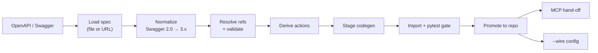

<!--
SPDX-FileCopyrightText: 2026 AOT Technologies

SPDX-License-Identifier: Apache-2.0
-->

# nw-connector-builder

Self-contained tool inside the **node-wire** repo with two subcommands:

| Command | Purpose |
|---------|---------|
| `nw-connector-builder from-openapi` | Turn a **Swagger 2.0** / **OpenAPI 3.x** document into a `node_wire_<id>` connector (and optionally an MCP host) |
| `nw-connector-builder mcp` | Generate an MCP host from an **existing** connector (same as standalone `nw-mcp-builder`) |

Use `from-openapi` when the upstream API already ships an OpenAPI/Swagger spec and you want a first-class Node Wire `RestConnector` instead of hand-writing schemas and `@nw_action` methods. Use `mcp` (or [nw-mcp-builder](mcp-servers.md)) for hand-written connectors. For the full happy path (codegen → Linux wheels → MCP host → wire → Docker), prefer the [`nw` CLI](nw-cli.md). For SDK-style or non-REST adapters, follow the hand-written path in [connectors.md](connectors.md).

---

## What this folder is

| Path | Purpose |
|------|---------|
| `nw-connector-builder/src/nw_connector_builder/` | CLI, load/normalize, derive, codegen, gate, promote, wire, MCP hand-off |
| `tests/nw_connector_builder/` | Pipeline and unit tests (run from the **node-wire** repo root) |

Generated output lands in the monorepo (not under `nw-connector-builder/`):

| Output | Location |
|--------|----------|
| Connector package | `src/node_wire_<id>/` |
| Publishable package metadata + model tests | `packages/connectors/<id>/` |
| Build report | `packages/connectors/<id>/report.json` (success) or `./report.json` (abort) |
| MCP host (unless `--no-mcp`) | `nw-mcp-builder/out/<name>-mcp/` |

---

## What it does (end to end)



For a connector id like `pet_store`:

1. **Load** — read the spec document from a local file path or `http(s)` URL (`--path`). URL fetches go through Node Wire's SSRF guard (`assert_safe_destination`) and never follow redirects. The raw bytes are decoded as UTF-8 and parsed as YAML/JSON into a document, then the version is detected from `swagger: "2.0"` vs. `openapi: "3.x"`.
2. **Normalize** — Swagger 2.0 documents are translated into OpenAPI 3.x in-house; OpenAPI 3.x documents pass through unchanged.
3. **Validate** — reject any **remote** (absolute-URL) `$ref`s outright (only local relative / in-document `#/` refs are allowed), resolve the remaining local `$ref`s in place with `prance`, then structurally and semantically validate the fully-resolved document with `openapi-spec-validator`. This step also resolves the connector's base URL (`--base-url` override, else the first `servers[]` entry).
4. **Derive** — from the validated document, work out the connector's auth plan (one connector-level default scheme, plus any additional per-action schemes — see [Auth mapping](#auth-mapping) below) and, per operation, either a plan for a generated `@nw_action` or a soft-drop reason (unsupported/divergent-and-unpresentable/AND-multi security, unsupported parameter styles, etc. — see [Soft-drop rules](#soft-drop-rules)).
5. **Codegen** — write a temp staging tree: `schema.py` (Pydantic input/output models) and `logic.py`, a `RestConnector` subclass with one `@nw_action`-decorated async method per derived action. Each method's `@nw_action(...)` decorator (`requires_auth=False` for anonymous actions) makes it discoverable by `nw-mcp-builder`'s regex scan; the method body itself calls `self.execute_rest(...)`, passing `auth_scheme=<name>` when the action uses a named, non-default scheme from step 4. Also emits the package `pyproject.toml` and model tests.
6. **Gate** — import smoke + `pytest` on staged model tests (must pass before promote)
7. **Promote** atomically into `src/node_wire_<id>/` and `packages/connectors/<id>/`
8. **MCP hand-off** (default) — call `nw-mcp-builder`, which regex-scrapes the promoted `logic.py` for `@nw_action` methods, for `out/<name>-mcp/`
9. **Wire** (optional `--wire`) — update `config/connectors.yaml` and `sample.env`

Promote never runs if the gate fails. MCP or `--wire` failures after a clean promote return exit code `1` but leave the connector in the tree.

---

## Requirements

- **Python 3.11+**
- **[uv](https://docs.astral.sh/uv/)** (recommended) or an editable install of the package
- Run from / against a **node-wire** checkout (default `--node-wire-root` is the parent of `nw-connector-builder/`)
- For URL specs: network access; fetches use Node Wire’s HTTP safety checks (`assert_safe_destination`) and do not follow redirects
- MCP hand-off needs **`nw-mcp-builder`** importable (declared as a path dependency of this package)

---

## Quick start

### 1. Install / sync the tool

```bash
cd nw-connector-builder
uv sync
```

From the node-wire repo root:

```bash
uv run --directory nw-connector-builder nw-connector-builder --help
```

### 2. Generate a connector

```bash
# Local file — connector only (skip MCP)
uv run --directory nw-connector-builder nw-connector-builder from-openapi \
  --path path/to/openapi.yaml \
  --id my_api \
  --no-mcp

# Remote Swagger/OpenAPI — overwrite if present, wire config, build MCP host
uv run --directory nw-connector-builder nw-connector-builder from-openapi \
  --path https://petstore.swagger.io/v2/swagger.json \
  --id pet_store \
  --force \
  --wire
```

`--id` must match `[a-z][a-z0-9_]*` (e.g. `pet_store`, not `PetStore`).

To regenerate an MCP host from an existing connector (no OpenAPI step):

```bash
uv run --directory nw-connector-builder nw-connector-builder mcp \
  -c pet_store --force-output
```

### 3. Run and verify

After a successful promote (and usually `--wire`):

```bash
# Ensure the connector is allowlisted (done automatically with --wire)
# NW_ALLOWED_CONNECTORS=...,pet_store

MODE=API uv run node-wire
```

Open [http://localhost:8000/docs](http://localhost:8000/docs). Generated actions appear under the new connector.

If MCP was generated:

```bash
cd nw-mcp-builder/out/pet-store-nw-mcp
cp .env.example .env   # fill secrets
uv sync
uv run python -m pet_store_nw_mcp
```

See [mcp-servers.md](mcp-servers.md) for ToolHive, Linux wheels, and Inspector.

### 4. Tests for the builder itself

From the **node-wire** repo root:

```bash
uv run pytest tests/nw_connector_builder -v --no-cov
```

---

## CLI reference

```
nw-connector-builder from-openapi --path <SPEC> --id <connector_id> [options]
nw-connector-builder mcp -c <connector_id> [options]
```

Legacy flat flags (`nw-connector-builder --path … --id …`) still map to `from-openapi`.

### `from-openapi`

| Option | Default | Description |
|--------|---------|-------------|
| `--path` | — (required) | Local path or `http(s)` URL to an OpenAPI/Swagger document |
| `--id` | — (required) | Connector id (`[a-z][a-z0-9_]*`) |
| `--wire` | off | After promote, edit `config/connectors.yaml` + `sample.env` |
| `--force` | off | Overwrite an existing connector tree; pass `--force-output` to MCP hand-off |
| `--no-mcp` | off | Stop after a clean connector promote (skip MCP host generation) |
| `--base-url` | `servers[0]` | Override baked-in default base URL (required if the spec has no absolute server URL) |
| `--node-wire-root` | Parent of `nw-connector-builder/` | Monorepo root used for promote / wire / MCP |
| `--report-path` | `./report.json` | Where to write `report.json` on **abort** (success writes beside the package) |
| `-v`, `--verbose` | off | Debug logging |

### `mcp`

Same flags as standalone `nw-mcp-builder` (see [mcp-servers.md](mcp-servers.md)): `-c` / `--connector-id`, `--force-output`, `--force-fixture`, `--skip-build-wheels`, `-o` / `--output-dir`, `--fixtures-dir`, `--python`, `--node-wire-root`, `-v`.

Help:

```bash
uv run --directory nw-connector-builder nw-connector-builder --help
uv run --directory nw-connector-builder nw-connector-builder from-openapi --help
uv run --directory nw-connector-builder nw-connector-builder mcp --help
```

### Exit codes

| Code | Meaning |
|------|---------|
| `0` | Clean build (gate + promote OK; MCP/wire OK or skipped) |
| `1` | Hard failure (load/derive/gate) **or** post-promote MCP/`--wire` failure |
| `2` | Usage error (bad `--id`, destination exists without `--force`, etc.) |

---

## Spec loading rules

| Topic | Behavior |
|-------|----------|
| Formats | YAML or JSON, UTF-8 |
| Versions | Swagger `2.0` (normalized to OpenAPI 3) or OpenAPI `3.x` |
| Sources | Local file path, or `http` / `https` URL |
| Remote `$ref` | **Rejected** — absolute remote refs are not fetched; keep a self-contained document (local relative/`#/` refs OK) |
| Validation | Resolved with `prance` + validated with `openapi-spec-validator` |
| Base URL | From `--base-url`, else first `servers[]` entry with substitutable defaults; relative-only servers hard-fail |

---

## Auth mapping

The builder picks **one connector-level default** security scheme (document `security`, else the most common scheme across operations) and maps it to a Node Wire auth provider for `--wire` / `connectors.yaml`:

| OpenAPI scheme | Node Wire `auth.provider` | Typical secret env |
|----------------|---------------------------|--------------------|
| `apiKey` in `header` | `static_token` | `<ID>_API_KEY` |
| `apiKey` in `query` | `apikey_query` | `<ID>_API_KEY` |
| `http` + `bearer` | `static_token` | `<ID>_TOKEN` |
| `http` + `basic` | `static_token` (`prefix: Basic`, base64) | `<ID>_BASIC_AUTH` |
| `oauth2` flow `clientCredentials` | `oauth2` (`grant_method: client_secret_post`) | `<ID>_CLIENT_ID`, `<ID>_CLIENT_SECRET` |
| `oauth2` flow `authorizationCode` | `oauth2` (`grant_method: refresh_token`) | `<ID>_CLIENT_ID`, `<ID>_CLIENT_SECRET`, `<ID>_REFRESH_TOKEN` (manual one-time step) |
| `oauth2` with no unattended flow (`implicit` / `password` / none declared), or `openIdConnect` | `static_token` (`prefix: Bearer`, `host_supplied: true`) | `<ID>_ACCESS_TOKEN` |
| None / unsupported only | `none` (anonymous) | — |

`<ID>_TOKEN_URL` is also emitted for both `oauth2` rows, pre-filled in `sample.env` with the
spec's `tokenUrl` (public API metadata, not a secret — kept as a reference like the rest of the
block so a sandbox/prod override never needs a code change). `authorizationCode` additionally
requires completing an interactive consent **outside** Node Wire before `<ID>_REFRESH_TOKEN` can
be set — see [nw-connector-builder-scope.md](nw-connector-builder-scope.md#oauth2-authorizationcode).

### Host-supplied tier

`oauth2` flows Node Wire cannot run unattended (`implicit`, `password`, or no flow the generator recognizes) and `openIdConnect` are **not** soft-dropped — they map to a **host-supplied** bearer token: Node Wire presents whatever value sits in `<ID>_ACCESS_TOKEN` as a plain `Bearer` header but never obtains, refreshes, or detects the expiry of it. The operator's host application is responsible for acquiring and rotating that token out-of-band. This is presentation only, never described as "supports implicit/password" — the acquisition ban on those flows is unchanged, see [nw-connector-builder-scope.md](nw-connector-builder-scope.md#out-of-scope). The build report's `auth.notes` spells out which scheme triggered it and the exact secret key to set.

**"Presents a bearer token" is not the same claim as "supports the flow."** At runtime this tier is the exact same `static_token` provider as a plain `http: bearer` scheme — Node Wire never calls a token endpoint or performs a grant exchange for it. It will happily present *any* bearer string, OAuth2-derived or not; that's a much weaker guarantee than the autonomous acquire-and-refresh behavior `clientCredentials`/`authorizationCode` actually get. See [nw-connector-builder-scope.md](nw-connector-builder-scope.md#host-supplied-auth-tier) for the full reasoning, including why `implicit` in particular carries a real operational cost (no refresh token by spec — the host must redo the full interactive consent every time the token expires).

### Per-action auth schemes

Operations that require a **different, still-presentable** scheme than the connector-level default (self-managed or host-supplied — anything except `mutualTLS`, cookie `apiKey`, AND-multi, or an unrecognized type) are no longer soft-dropped as divergent. Instead the builder emits an **additional, named** scheme in `auth_schemes:` (alongside the default `auth:` block) and routes just those actions to it via `auth_scheme=<scheme_name>` on the generated `@nw_action` call — the runtime resolves it with `resolve_auth_provider(auth_scheme)`, which fails closed on an unknown name. This is what lets one connector serve multiple OpenAPI security schemes from a single instance — e.g. `petstore.swagger.io`, where most operations use an `apiKey` default but a handful require an `oauth2` (`implicit`) scheme that's now generated as a host-supplied `auth_schemes` entry instead of being dropped.

**Still soft-dropped** as unsupported (operations that require only these are skipped):

- `mutualTLS`
- Cookie API keys (`apiKey` `in: cookie`)
- AND multi-scheme requirements (`security: [{ a: [], b: [] }]`)
- Unrecognized scheme types

---

## Soft-drop rules

Unsupported operations are **skipped** (listed in the report) rather than aborting the build — unless **zero** operations remain (hard failure).

Common soft-drop reasons:

- Unsupported / divergent / AND-multi security
- `in: cookie` parameters
- Unsupported serialization styles (e.g. query `deepObject`, non-`simple` path/header styles)
- Unresolved parameter `$ref`s after the load step

A **coverage warning** is printed when fewer than 50% of document operations were generated.

Path/operation-level `servers` are ignored in v1 (noted in the report).

---

## Generated layout

After promote:

```
src/node_wire_<id>/
  __init__.py
  schema.py          # Pydantic input models + outputs (or RestResponseOutput)
  logic.py           # RestConnector subclass with @nw_action methods (no error_map by default)

packages/connectors/<id>/
  pyproject.toml     # entry point + deps
  report.json        # full build report
  tests/
    test_<id>_models.py   # polyfactory round-trip (+ example parse when present)
```

Generated files are marked `# Generated by nw-connector-builder — do not hand-edit.` Prefer regenerating with `--force` over hand-patching; if you must customize, treat the tree as owned source and stop overwriting it.

Complex request bodies and non-object success responses use permissive typing (`Any` / `RestResponseOutput`) for robustness.

---

## Staging gate

Before promote, the builder:

1. **Import smoke** — load `node_wire_<id>.logic`, find a `RestConnector` with matching `connector_id`, require at least one `@nw_action`
2. **pytest** — run staged `packages/connectors/<id>/tests` with `PYTHONPATH` pointing at staged `src/`

Gate failure writes `report.json` to `--report-path` (default cwd) and exits `1` without mutating the repo.

---

## Promote semantics

Promote is a two-phase commit across both trees (`src/node_wire_<id>` and `packages/connectors/<id>`):

1. Copy staging → `*.promoting` siblings
2. Move existing destinations aside to `*.bak` (if any)
3. Rename `*.promoting` → final paths
4. On failure, restore backups and discard promoting leftovers

If either destination already exists, you must pass **`--force`**.

---

## `--wire` behavior

When `--wire` is set after a clean promote:

**`config/connectors.yaml`** — upserts:

```yaml
connectors:
  <id>:
    enabled: true
    exposed_via: ["rest", "grpc", "mcp"]
    base_url: <derived or --base-url>
    auth:   # omitted when anonymous
      provider: ...
      secret_key: ...
    auth_schemes:   # only present when a divergent scheme needed its own auth_scheme=
      <scheme_name>:
        provider: ...
        secret_key: ...
```

**`sample.env`** — appends the connector to `NW_ALLOWED_CONNECTORS` and adds empty placeholders for derived secret keys (e.g. `PET_STORE_API_KEY=`, and `PET_STORE_ACCESS_TOKEN=` for a host-supplied scheme).

Wire edits preserve YAML comments via `ruamel.yaml`. Failures set exit code `1` but do not roll back the promoted connector.

---

## MCP hand-off

Unless `--no-mcp` is set, the builder calls `nw-mcp-builder` with:

- `force_fixture=True` (fixture must track the newly promoted connector)
- `force_output=<value of --force>`

MCP details (wheels, ToolHive, Inspector) live in [mcp-servers.md](mcp-servers.md). A failed hand-off returns exit code `1` after a successful promote — re-run either of these once the connector tree is good:

```bash
uv run --directory nw-connector-builder nw-connector-builder mcp -c <id> --force-output
# equivalent:
uv run --directory nw-mcp-builder nw-mcp-builder -c <id> --force-output
```

---

## Build report

Stdout summary plus JSON:

| Field | Meaning |
|-------|---------|
| `summary` | id, source, version, content hash, counts, errors |
| `generated_actions` | method, path, action name, auth flag |
| `skipped` | soft-dropped ops + reasons |
| `auth` | chosen provider / secret key / yaml block |
| `gate` / `mcp` / `wire` | stage outcomes when run |

On success: `packages/connectors/<id>/report.json`  
On abort: `--report-path` or `./report.json`

---

## Environment variables (generated connectors)

Generated `RestConnector`s honor the same egress controls as other REST adapters:

| Variable | Purpose |
|----------|---------|
| `NW_REST_ALLOWED_HOSTS` | Egress allowlist for outbound HTTP |
| `NW_REST_TRUST_ENV` | Set `true` to honor `HTTP(S)_PROXY` (default off) |

Plus connector-specific secrets from the auth plan (`<ID>_API_KEY`, `<ID>_TOKEN`, …) when using `--wire` / `sample.env`.

---

## After generation — publishing checklist

`nw-connector-builder` creates the **runtime + package skeleton**. To ship on PyPI or as a standalone MCP Docker image, still complete the Tier 2 / Tier 3 steps in [packaging.md](packaging.md):

- [ ] Add `packages/connectors/<id>/setup.py` (Cython build glue) if publishing binary wheels
- [ ] Register the entry point in the **root** `pyproject.toml` for editable monorepo installs (if not already covered by your workflow)
- [ ] Add the path to `scripts/build-packages.sh` (`ALL_PACKAGES`) and CI allowlists (`nw gen-all` without `--no-wire` inserts the `ALL_PACKAGES` entry; CI allowlists stay manual)
- [ ] Update the package inventory in [packaging.md](packaging.md)
- [ ] Optional standalone MCP image rows in [mcp-servers.md](mcp-servers.md) / `docker-compose.mcp.yml` (the thin host under `nw-mcp-builder/out/` is separate from repo `docker/<name>/` images)

---

## Related docs

| Doc | When to read it |
|-----|-----------------|
| [nw-cli.md](nw-cli.md) | Orchestrated codegen → wheels → MCP → Docker |
| [connectors.md](connectors.md) | Hand-written connectors, `BaseConnector`, auth patterns |
| [mcp-servers.md](mcp-servers.md) | Running / packaging the generated MCP host |
| [packaging.md](packaging.md) | Wheels, PyPI, CI allowlists |
| [configuration.md](configuration.md) | `connectors.yaml` and env vars |
| [local-packages-to-images.md](local-packages-to-images.md) | Wheel → Docker image workflow |
